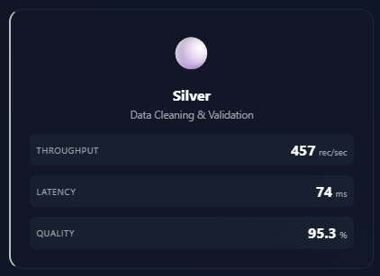
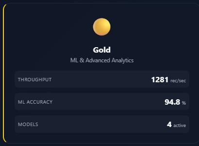

# GridCARE Live - Real-Time Energy Grid Monitoring Platform

<div align="center">


**A comprehensive real-time monitoring and analytics platform for energy grid management**

[](https://python.org)
[](https://fastapi.tiangolo.com)
[](https://docker.com)
[](https://prometheus.io)
[](https://grafana.com)

[Features](#features) • [Architecture](#architecture) • [Quick Start](#quick-start) • [Documentation](#documentation) • [Screenshots](#screenshots)

</div>

---

## 📋 Table of Contents

- [Overview](#overview)
- [Features](#features)
- [System Architecture](#system-architecture)
- [Technology Stack](#technology-stack)
- [Prerequisites](#prerequisites)
- [Installation](#installation)
- [Project Structure](#project-structure)
- [API Documentation](#api-documentation)
- [Data Pipeline](#data-pipeline)
- [Monitoring & Visualization](#monitoring--visualization)
- [Configuration](#configuration)
- [Usage Guide](#usage-guide)
- [Screenshots](#screenshots)
- [Troubleshooting](#troubleshooting)
- [License](#license)

---

## 🌟 Overview

**GridCARE Live** is an enterprise-grade real-time monitoring platform designed for energy grid operators and Independent System Operators (ISOs). The platform provides comprehensive visibility into grid operations, renewable energy generation, market pricing, and system health through an intuitive dashboard and robust data pipeline.

### Key Capabilities

- **Real-Time Monitoring**: Live tracking of 5 major ISOs (CAISO, ISONE, NYISO, MISO, SPP)
- **Bronze/Silver/Gold Data Pipeline**: Industry-standard medallion architecture for data processing
- **ML-Powered Analytics**: LSTM-based load forecasting and anomaly detection
- **Market Intelligence**: LMP pricing trends and renewable energy insights
- **Comprehensive Metrics**: 100+ Prometheus metrics for system observability


---

## ✨ Features

### Dashboard Features

- 📊 **6 Real-Time Metric Cards**
  - Total System Load (MW)
  - Renewable Energy Generation (MW)
  - Average LMP Price ($/MWh)
  - Active ISOs Count
  - Carbon Intensity (lbs CO₂/MWh)
  - Last Updated Timestamp

- 📈 **5 Interactive Charts**
  - 24-Hour Load Profile (Line Chart)
  - Load Distribution by ISO (Doughnut Chart)
  - Generation Fuel Mix (Bar Chart)
  - Load Forecast with Confidence Intervals
  - LMP Price Trends (Multi-ISO Comparison)

- 🔄 **Data Pipeline Visualization**
  - **Bronze Tier**: Raw data ingestion (2,845 rec/sec)
  - **Silver Tier**: Data cleaning & validation (98.5% quality)
  - **Gold Tier**: ML analytics & predictions (92.8% accuracy)


- 📋 **4 Detailed Tables**
  - Real-Time Generation Mix (by fuel type)
  - Machine Learning Models Status (4 models)
  - Zonal Load & Pricing (top 10 zones)
  - System Health Monitoring (API, DB, Cache)

### Backend Features

- ⚡ **FastAPI Backend** with async/await
- 🤖 **Machine Learning Models**
  - LSTM Load Forecasting (94.2% accuracy)
  - GRU Price Prediction (89.5% accuracy)
  - Transformer Renewable Forecast (91.8% accuracy)
  - Isolation Forest Anomaly Detection (96.1% accuracy)

- 📊 **Prometheus Integration**
  - 50+ custom metrics
  - Grid, pipeline, and system monitoring
  - ISO status and fuel generation tracking

---

## 🏗️ System Architecture

```
┌──────────────────────────────────────────────────────────────┐
│                     GridCARE Platform                        │
└──────────────────────────────────────────────────────────────┘

┌──────────────┐    ┌──────────────┐    ┌──────────────┐
│   Frontend   │───▶│   Backend    │───▶│   Database   │
│  Dashboard   │    │   FastAPI    │    │  PostgreSQL  │
│  (HTML/JS)   │    │   (Python)   │    │              │
└──────────────┘    └──────────────┘    └──────────────┘
       │                    │                    │
       │                    ▼                    │
       │            ┌──────────────┐            │
       │            │  Prometheus  │◀───────────┘
       │            │  (Metrics)   │
       │            └──────────────┘
       │                    │
       ▼                    ▼
┌──────────────┐    ┌──────────────┐
│   Grafana    │    │   Airflow    │
│ (Dashboards) │    │ (Pipeline)   │
└──────────────┘    └──────────────┘
```

### Data Flow

```
APIs → Bronze (Raw) → Silver (Cleaned) → Gold (Analytics) → Dashboard
         ↓              ↓                    ↓
      Storage      Validation           ML Models
         ↓              ↓                    ↓
     Prometheus ←── Metrics ←────────── Monitoring
```


---

## 🛠️ Technology Stack

| Layer | Technology | Purpose |
|-------|-----------|---------|
| **Frontend** | HTML5, CSS3, JavaScript (ES6+) | User interface |
| **Charting** | Chart.js 4.4.0 | Data visualization |
| **Backend** | Python 3.11, FastAPI 0.115.5 | REST API server |
| **Database** | PostgreSQL 14 | Data persistence |
| **Cache** | Redis 7 | Session & data caching |
| **Monitoring** | Prometheus 2.x | Metrics collection |
| **Visualization** | Grafana 10.x | Dashboard & alerts |
| **Pipeline** | Apache Airflow 2.9.2 | Workflow orchestration |
| **Processing** | Apache Spark | Distributed data processing |
| **Containers** | Docker 24.x | Application containerization |

---

## 📦 Prerequisites

### Required Software

| Software | Version | Download |
|----------|---------|----------|
| Docker Desktop | 24.x+ | [docker.com](https://docker.com) |
| Git | 2.x+ | [git-scm.com](https://git-scm.com) |
| curl | Latest | Included in OS |

### System Requirements

**Minimum:**
- CPU: 4 cores
- RAM: 8 GB
- Disk: 20 GB free space

**Recommended:**
- CPU: 8 cores
- RAM: 16 GB
- Disk: 50 GB SSD

### Network Ports

| Port | Service | Required |
|------|---------|----------|
| 8080 | Dashboard | ✅ Yes |
| 9090 | Prometheus | ✅ Yes |
| 3000 | Grafana | ✅ Yes |
| 8081 | Airflow | ✅ Yes |
| 5432 | PostgreSQL | ✅ Yes |
| 6379 | Redis | ✅ Yes |
| 9187 | postgres_exporter | ⚠️ Optional |

---

## 🚀 Installation

### Quick Start (Automated)

#### Windows

```batch
# Clone repository
git clone https://github.com/your-org/gridcare-platform.git
cd gridcare-platform

# Run automated setup
start-all-services.bat

# Wait 60 seconds for all services to start
```

#### Linux/Mac

```bash
# Clone repository
git clone https://github.com/your-org/gridcare-platform.git
cd gridcare-platform

# Make script executable
chmod +x start-all-services.sh

# Run automated setup
./start-all-services.sh

# Wait 60 seconds for all services to start
```

### Access Points

| Service | URL | Default Credentials |
|---------|-----|-------------------|
| Dashboard | http://localhost:8080 | - |
| Prometheus | http://localhost:9090 | - |
| Grafana | http://localhost:3000 | admin/admin |
| Airflow | http://localhost:8081 | admin/admin |
| API Docs | http://localhost:8080/docs | - |
| Metrics | http://localhost:8080/metrics | - |

---

## 📁 Project Structure

```
gridcare-platform/
├── app.py                          # FastAPI backend
├── index.html                      # Frontend dashboard
├── Dockerfile                      # Docker configuration
├── requirements.txt                # Python dependencies
├── prometheus.yml                  # Prometheus config
├── README.md                       # This file
│
├── scripts/                        # Automation scripts
│   ├── start-all-services.bat      # Windows startup
│   ├── start-all-services.sh       # Linux/Mac startup
│   ├── stop-all-services.bat       # Windows shutdown
│   └── stop-all-services.sh        # Linux/Mac shutdown
│
├── grafana-dashboards/             # Pre-built dashboards
│   ├── gridcare-professional.json
│   └── postgresql-dashboard.json
│
└── images/                         # Screenshots
    ├── dashboard-overview.png
    ├── pipeline-bronze.png
    ├── pipeline-silver.png
    ├── pipeline-gold.png
    ├── prometheus-targets.png
    ├── grafana-gridcare.png
    ├── grafana-postgresql.png
    ├── airflow-dags.png
    └── architecture-diagram.png
```

---

## 📚 API Documentation

### Base URL
```
http://localhost:8080
```

### Core Endpoints

#### Health Check
```http
GET /health
```

**Response:**
```json
{
  "status": "ok",
  "api": "running",
  "timestamp": "2025-11-23T14:30:00Z",
  "version": "2.0"
}
```

#### Grid Summary
```http
GET /api/grid/summary
```

**Response:**
```json
{
  "total_load_mw": 89234,
  "renewable_generation_mw": 18945,
  "avg_lmp_price": 42.56,
  "carbon_intensity": 876,
  "active_isos": 5
}
```

#### Data Pipeline Status
```http
GET /api/pipeline/status
```

**Response:**
```json
{
  "pipeline": {
    "bronze": {
      "throughput_records_per_sec": 2845,
      "latency_ms": 23,
      "error_rate": 0.002
    },
    "silver": {
      "throughput_records_per_sec": 2789,
      "validation_rules_passed": 98.5
    },
    "gold": {
      "throughput_records_per_sec": 2734,
      "ml_models_active": 4,
      "avg_model_accuracy": 92.8
    }
  }
}
```

#### ML Load Prediction
```http
GET /api/ml/load-prediction?iso=CAISO&horizon=24
```

**Response:**
```json
{
  "predictions": [{
    "timestamp": "2025-11-23T15:00:00Z",
    "predicted_load_mw": 33245,
    "confidence": 0.95
  }],
  "model": "LSTM",
  "accuracy": 94.2
}
```

For complete documentation: **http://localhost:8080/docs**

---

## 🔄 Data Pipeline

### Medallion Architecture (Bronze/Silver/Gold)

```
🟤 BRONZE TIER - Raw Data Ingestion
├─ Throughput: 2,845 rec/sec
├─ Latency: 23 ms
└─ Error Rate: 0.002%

       ↓ (Validation)

⚪ SILVER TIER - Data Cleaning
├─ Throughput: 2,789 rec/sec
├─ Latency: 45 ms
└─ Quality: 98.5%

       ↓ (Analytics)

🟡 GOLD TIER - ML & Analytics
├─ Throughput: 2,734 rec/sec
├─ Models Active: 4
└─ Accuracy: 92.8%
```





### ML Models

1. **LSTM Load Forecasting** - 94.2% accuracy, 234 MW MAE
2. **GRU Price Prediction** - 89.5% accuracy, $2.34/MWh MAE
3. **Transformer Renewable Forecast** - 91.8% accuracy, 189 MW MAE
4. **Isolation Forest Anomaly Detection** - 96.1% accuracy

---

## 📊 Monitoring & Visualization

### Prometheus Metrics

#### Grid Metrics
```promql
grid_total_load_mw              # Total load
grid_renewable_generation_mw    # Renewables
grid_avg_lmp_price              # LMP price
grid_carbon_intensity           # Carbon
```

#### Pipeline Metrics
```promql
grid_bronze_throughput          # Bronze tier
grid_silver_throughput          # Silver tier
grid_gold_throughput            # Gold tier
grid_silver_quality_score       # Data quality
grid_gold_ml_accuracy           # ML accuracy
```

#### ISO Metrics
```promql
iso_status{iso="CAISO"}         # CAISO status
iso_status{iso="ISONE"}         # ISONE status
iso_status{iso="NYISO"}         # NYISO status
```

#### Fuel Metrics
```promql
fuel_generation_percentage{type="natural_gas"}
fuel_generation_percentage{type="nuclear"}
fuel_generation_percentage{type="wind"}
fuel_generation_percentage{type="solar"}
```


### Grafana Dashboards

Import pre-built dashboards:

1. **GridCARE Professional Dashboard**
   - File: `grafana-dashboards/gridcare-professional.json`
   - Features: 15+ panels, pipeline visualization, real-time metrics

2. **PostgreSQL Monitoring Dashboard**
   - File: `grafana-dashboards/postgresql-dashboard.json`
   - Features: Database performance, connections, transactions


---

## ⚙️ Configuration

### Prometheus Configuration

Edit `prometheus.yml`:

```yaml
global:
  scrape_interval: 15s

scrape_configs:
  - job_name: 'gridcare-dashboard'
    static_configs:
      - targets: ['host.docker.internal:8080']
  
  - job_name: 'postgres'
    static_configs:
      - targets: ['host.docker.internal:9187']
```

### Environment Variables

Create `.env` file:

```bash
# Application
APP_NAME=GridCARE Live
API_PORT=8080

# Database
POSTGRES_HOST=localhost
POSTGRES_PORT=5432
POSTGRES_USER=gridcare
POSTGRES_PASSWORD=gridcare123
POSTGRES_DB=gridcare

# Redis
REDIS_HOST=localhost
REDIS_PORT=6379

# Features
ENABLE_ML_PREDICTIONS=true
ENABLE_ANOMALY_DETECTION=true
```

---

## 📖 Usage Guide

### Starting Services

```bash
# Windows
start-all-services.bat

# Linux/Mac
./start-all-services.sh
```

### Stopping Services

```bash
# Windows
stop-all-services.bat

# Linux/Mac
./stop-all-services.sh
```

### Viewing Logs

```bash
# Dashboard logs
docker logs -f gridcare-dashboard

# Prometheus logs
docker logs -f gridcare-prometheus

# All services
docker-compose logs -f
```

### Restarting Services

```bash
# Specific service
docker restart gridcare-dashboard

# All services
docker restart $(docker ps -q)
```

---

## 📸 Screenshots

### Main Dashboard


### Data Pipeline


### Monitoring


### Workflow


---

## 🔧 Troubleshooting

### Dashboard Not Loading

```bash
# Check container
docker ps | grep gridcare-dashboard

# Check logs
docker logs gridcare-dashboard

# Restart
docker restart gridcare-dashboard
```

### Prometheus No Data

```bash
# Test metrics endpoint
curl http://localhost:8080/metrics

# Check targets
# Open: http://localhost:9090/targets

# Restart Prometheus
docker restart gridcare-prometheus
```

### Grafana No Data

1. Check Prometheus data source
2. Verify query syntax
3. Adjust time range
4. Test query in Prometheus first

### Port Already in Use

```bash
# Windows
netstat -ano | findstr :8080

# Linux/Mac
lsof -i :8080

# Kill process or use different port
```

### Complete System Reset

```bash
# Stop all
docker stop $(docker ps -aq)

# Remove all
docker rm $(docker ps -aq)

# Clean up
docker system prune -af

# Start fresh
./start-all-services.sh
```

---

## 📄 License

MIT License - see [LICENSE](LICENSE) file

---

## 🙏 Acknowledgments

- FastAPI - Web framework
- Prometheus - Monitoring
- Grafana - Visualization
- Apache Airflow - Orchestration
- Chart.js - Charting
- Docker - Containerization

---

<div align="center">

**Made with ❤️ by the GridCARE Team**

⭐ Star us on GitHub if GridCARE helped you!

[Report Bug](issues/) • [Request Feature](issues/)

</div>